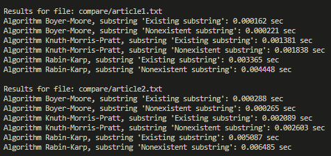

# Performance Comparison of Substring Search Algorithms

## Summary

The performance of three substring search algorithms—Boyer-Moore, Knuth-Morris-Pratt, and Rabin-Karp—was tested on two text files (`article1.txt` and `article2.txt`). Each algorithm was applied to two types of substrings: one that exists in the text and one that does not.

## Results

### For `article1.txt`:
- **Boyer-Moore** was the fastest for both the existing substring (0.000162 sec) and the nonexistent substring (0.000221 sec).
- **Knuth-Morris-Pratt** showed moderate performance with 0.001381 sec for the existing substring and 0.001838 sec for the nonexistent one.
- **Rabin-Karp** was the slowest, with 0.003065 sec for the existing substring and 0.004448 sec for the nonexistent substring.

### For `article2.txt`:
- **Boyer-Moore** was again the fastest, with times of 0.000288 sec for the existing substring and 0.000265 sec for the nonexistent one.
- **Knuth-Morris-Pratt** had moderate results, taking 0.002009 sec for the existing substring and 0.002603 sec for the nonexistent one.
- **Rabin-Karp** remained the slowest, with times of 0.005087 sec for the existing substring and 0.006485 sec for the nonexistent one.

## Conclusion
- **Boyer-Moore** consistently showed the fastest performance for both existing and nonexistent substrings in both text files, making it the most efficient algorithm in this comparison.
- **Knuth-Morris-Pratt** performed moderately well but was noticeably slower than Boyer-Moore.
- **Rabin-Karp** was the slowest algorithm across all tests, particularly for nonexistent substrings.

Overall, **Boyer-Moore** is recommended as the fastest and most efficient algorithm for substring search in these texts.

## Example of Console Output

Below is a screenshot of the console output showing the runtime comparison

